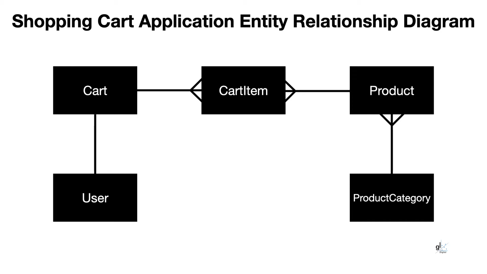

# Shop.API Documentation
## Folder Structure
### Entities
The `Entities` folder contains the classes that represent the data model of the application. 
These classes are used to interact with the database and are used to pass data between the different layers of the application.

#### Dependencies
- Microsoft.EntityFrameworkCore

EntityFramework is a NuGet package that allows us to create the database using a code first approach. 
The classes in this folder are used to define the tables in the database.

#### Classes
- `Product`
- `ProductCategory`
- `Cart`
- `CartItem`
- `User`

Each of these classes represents a table in the database.

#### Relationships

- `Cart` has a one-to-many relationship with the `CartItem` entity.
- `Product` has a one-to-many relationship with the `CartItem` entity.
- `ProductCategory` has a one-to-many relationship with the `Product` entity.
- `User` has a one-to-many relationship with the `Cart` entity.

#### Extensions
In C#, the `Extensions` directory typically contains static classes that provide extension methods. Extension methods enable you to "add" methods to existing types without creating a new derived type, recompiling, or otherwise modifying the original type.

The `DtoConversions` class, located in `Shop.API/Extensions/DtoConversions.cs`, is one such static class that provides extension methods for converting entities to Data Transfer Objects (DTOs). DTOs are simple objects that allow data to be transferred between processes or across the network.

The `DtoConversions` class has two methods:

1. `ConvertToDto(this IEnumerable<Product> products, IEnumerable<ProductCategory> productCategories)`: This method converts a collection of `Product` entities to `ProductDto` objects. It performs a join operation between `Product` and `ProductCategory` collections based on the `CategoryId`, and then projects the result into a new `ProductDto` object.

2. `ConvertToDto(this IEnumerable<User> users)`: This method converts a collection of `User` entities to `UserDto` objects. It projects each `User` entity into a new `UserDto` object.

These methods are used to convert entities to DTOs, which are simpler objects that can be used to transfer data between processes or across the network. For example, in `Shop.API/Controllers/ProductController.cs`, the `GetItems` method uses `ConvertToDto` to convert products to DTOs before returning them in an API response.